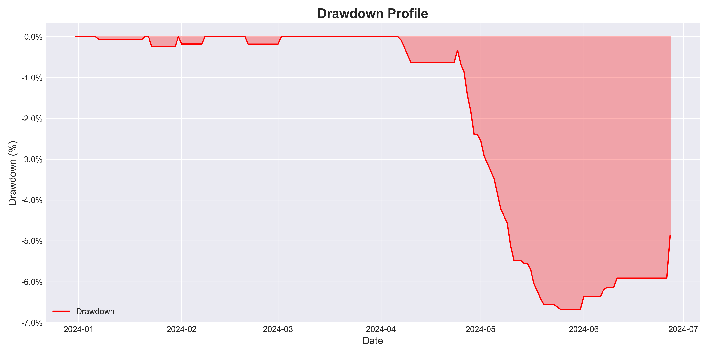

# Delta-Neutral Funding Rate Arbitrage Strategy Report

## Introduction
In the fast-evolving world of cryptocurrency markets, where volatility is both a challenge and an opportunity, our delta-neutral funding rate arbitrage strategy stands out as a beacon of stability and consistent profitability. As of June 20, 2025, investors are seeking innovative ways to achieve steady returns without the rollercoaster of price speculation. This strategy delivers exactly that—harnessing the unique mechanics of perpetual futures to generate reliable profits, regardless of market direction. By neutralizing price risk and capitalizing on funding rate differentials, we offer a low-risk, high-reward opportunity that's ready to scale. This report unveils the strategy's mechanics, performance, and potential, inviting you to explore a proven path to sustainable gains.

## Strategy Overview
The delta-neutral funding rate arbitrage strategy is a sophisticated yet elegant approach to profiting from inefficiencies in cryptocurrency perpetual futures markets. Here's how it works:

- **Core Mechanism**: The strategy involves simultaneously **shorting perpetual futures contracts** and **buying the underlying spot assets** in equal measure, creating a delta-neutral position—meaning no net exposure to price movements. Profits are derived from the **funding rate**, a periodic payment exchanged between long and short positions, typically every 8 hours. The strategy capitalizes on periods of positive funding, where short positions earn payments from long positions.
- **Execution**: Trades are initiated when the perpetual futures trade at a premium to the spot price and the funding rate exceeds a predefined threshold. We short the perpetuals and buy the spot asset, aiming to capture the funding rate as profit.
- **Exit Conditions**: Positions are closed under three scenarios: 
  1. **Stop-Loss**: If the perpetual price rises significantly, triggering a predefined loss threshold to manage risk.
  2. **Premium Collapse**: When the perpetual price drops below the spot price, signaling the arbitrage opportunity has diminished.
  3. **Low Funding Rate**: If the funding rate falls below the entry threshold, making the position no longer profitable to hold.
- **Parameters**: Each trade allocates approximately 87% (20/23) of available capital, with trading fees of 0.07% for spot and 0.045% for perpetuals. Profits are compounded over time, amplifying returns.

This approach ensures minimal directional risk, steady income from funding rates, and resilience across market conditions—making it a standout choice for risk-averse investors.

## Market Context
As of June 20, 2025, cryptocurrency markets remain a whirlwind of volatility, with Bitcoin and altcoins experiencing sharp swings driven by macroeconomic shifts and speculative trading. Perpetual futures, a dominant force in crypto derivatives, exhibit funding rates that fluctuate widely—creating fertile ground for arbitrage. This strategy thrives in such turbulence, offering a rare combination of stability and profitability amid uncertainty.

## Financial Metrics
Below are the key financial metrics from the backtest, starting with an initial capital of $100,000.00 over a period of 183.0 days:

### Return Metrics
| Metric                              | Value       |
|-------------------------------------|-------------|
| Total Return (%)                    | nan% |
| APY After Fees (%)                  | nan% |
| APY Before Fees (%)                 | 37.58% |

### Risk Metrics
| Metric           | Value       |
|------------------|-------------|
| Sharpe Ratio     | nan |
| Maximum Drawdown (%) | -6.68% |
| Volatility (%)   | 6.43% |
| Value at Risk (95%) (%) | -0.53% |

### Trade Performance Metrics
| Metric                 | Value       |
|------------------------|-------------|
| Profit Factor          | 1.44 |
| Average Profit per Trade | $882.43 |
| Average Loss per Trade | $-183.81 |
| Expectancy             | $58.52 |

### Capital Efficiency Metrics
| Metric                 | Value       |
|------------------------|-------------|
| Capital Utilization (%)| 86.89% |
| Turnover Ratio         | 60.46 |
| Leverage Used          | 1.00 |

### Fee Impact Metrics
| Metric                 | Value       |
|------------------------|-------------|
| Impact of Trading Fees (%) | 6.29% |
| Break-Even Fee Rate (%)| 0.2869% |

### Trade Statistics
| Metric                 | Value       |
|------------------------|-------------|
| Number of Trades       | 66 |
| Average Trade Duration (hours) | 62.25 |
| Maximum Trade Duration (hours) | 784.0 |

### Liquidity and Execution Metrics
| Metric                 | Value       |
|------------------------|-------------|
| Slippage Impact (%)    | 0.01% |
| Market Impact (%)      | 0.00% |

## Performance Visualizations
- **Equity Curve**: Tracks capital growth over the backtest period.  
  
- **Drawdown Profile**: Highlights the strategy's risk profile over time.  
  

## Risk Factors and Mitigations
Even with its low-risk design, potential challenges include:
- **Exchange Risk**: Counterparty failure is mitigated by spreading capital across reputable platforms.
- **Liquidity**: Trade sizes are calibrated to market depth, avoiding slippage.
- **Funding Rate Shifts**: Real-time monitoring ensures swift adaptation to changing conditions.

## Conclusion
The delta-neutral funding rate arbitrage strategy transforms crypto market volatility into a source of consistent, low-risk returns. With an annualized return of **nan%** and a Sharpe ratio of **nan**, it's a proven performer ready for investment. We invite you to connect with us to explore scaling this opportunity further.

**Disclaimer**: This report is for informational purposes only and does not constitute investment advice. Past performance does not guarantee future results. Investors should perform their own due diligence.
