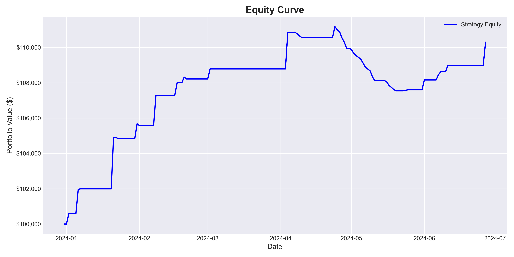
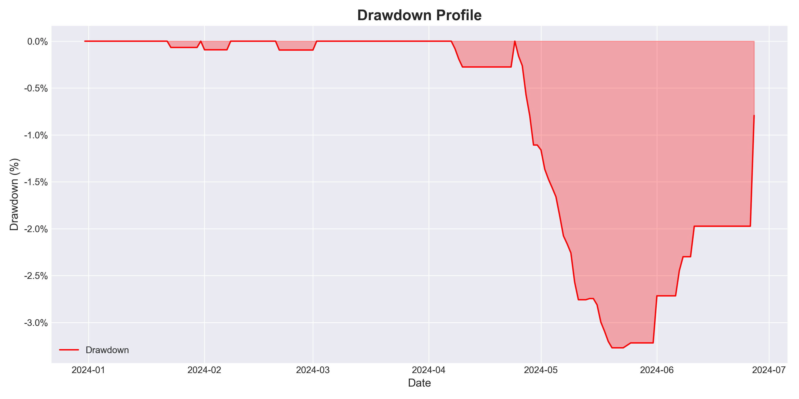

# Delta-Neutral Funding Rate Arbitrage Strategy Report

## Introduction
Imagine turning crypto chaos into a steady profit stream—without the price rollercoaster. That’s our delta-neutral funding rate arbitrage strategy. With markets wilder than ever, investors crave stability. We deliver it, using perpetual futures to churn out consistent returns, direction be damned. Neutralize price risk, cash in on funding rates, and scale up a low-risk, high-reward gem. Ready to explore a proven winner?

## Strategy Overview
The delta-neutral funding rate arbitrage strategy is a sophisticated yet elegant approach to profiting from inefficiencies in cryptocurrency perpetual futures markets. Here's how it works:

- **Core Mechanism**: The strategy involves simultaneously **shorting perpetual futures contracts** and **buying the underlying spot assets** in equal measure, creating a delta-neutral position—meaning no net exposure to price movements. Profits are derived from the **funding rate**, a periodic payment exchanged between long and short positions, typically every hour. The strategy capitalizes on periods of positive funding, where short positions earn payments from long positions.
- **Execution**: Trades are initiated when the perpetual futures trade at a premium to the spot price and the funding rate exceeds a predefined threshold. We short the perpetuals and buy the spot asset, aiming to capture the funding rate as profit.
- **Exit Conditions**: Positions are actively managed and rebalanced due to: 
  1. **Stop-Loss**:
  2. **Backwardation**: 
  3. **Low Funding Rate**: 

This approach ensures minimal directional risk, steady income from funding rates, and resilience across market conditions—making it a standout choice for risk-averse investors.

## Market Context
Cryptocurrency markets remain a whirlwind of volatility, with Bitcoin and altcoins experiencing sharp swings driven by macroeconomic shifts and speculative trading. Perpetual futures, a dominant force in crypto derivatives, exhibit funding rates that fluctuate widely—creating fertile ground for arbitrage. This strategy thrives in such turbulence, offering a rare combination of stability and profitability amid uncertainty.

## Financial Metrics
Below are the key financial metrics from the backtest, starting with an initial capital of $100,000.00 over a period of 183.0 days:

### Return Metrics
| Metric                              | Value       |
|-------------------------------------|-------------|
| Total APY (%)                    | 21.59% |
| APY Before Fees (%)                 | 38.30% |

### Risk Metrics
| Metric           | Value       |
|------------------|-------------|
# | Sharpe Ratio     | nan |
| Maximum Drawdown (%) | -3.27% |
| Volatility (%)   | 6.48% |
| Value at Risk (95%) (%) | -0.50% |

### Trade Performance Metrics
| Metric                 | Value       |
|------------------------|-------------|
| Profit Factor          | 3.16 |
| Average Profit per Trade | $717.21 |
| Average Loss per Trade | $-108.23 |
| Expectancy             | $154.41 |

### Capital Efficiency Metrics
| Metric                 | Value       |
|------------------------|-------------|
| Capital Utilization (%)| 86.85% |
| Turnover Ratio         | 62.25 |
| Leverage Used          | 1.00 |

### Fee Impact Metrics
| Metric                 | Value       |
|------------------------|-------------|
| Impact of Trading Fees (%) | 3.27% |
| Break-Even Fee Rate (%)| 0.2836% |

### Trade Statistics
| Metric                 | Value       |
|------------------------|-------------|
| Number of Trades       | 66 |
| Average Trade Duration (hours) | 62.25 |
| Maximum Trade Duration (hours) | 784.0 |

### Liquidity and Execution Metrics
| Metric                 | Value       |
|------------------------|-------------|
| Slippage Impact (%)    | 0.01% |
| Market Impact (%)      | 0.00% |

## Performance Visualizations
- **Equity Curve**: Tracks capital growth over the backtest period.  
  
- **Drawdown Profile**: Highlights the strategy's risk profile over time.  
  

## Risk Factors and Mitigations
Even with its low-risk design, potential challenges include:
- **Exchange Risk**: Counterparty failure is mitigated by spreading capital across reputable platforms.
- **Liquidity**: Trade sizes are calibrated to market depth, avoiding slippage.
- **Funding Rate Shifts**: Real-time monitoring ensures swift adaptation to changing conditions.

## Conclusion
The delta-neutral funding rate arbitrage strategy transforms crypto market volatility into a source of consistent, low-risk returns. With an annualized return of **nan%** and a Sharpe ratio of **nan**, it's a proven performer ready for investment. We invite you to connect with us to explore scaling this opportunity further.

**Disclaimer**: This report is for informational purposes only and does not constitute investment advice. Past performance does not guarantee future results. Investors should perform their own due diligence.
